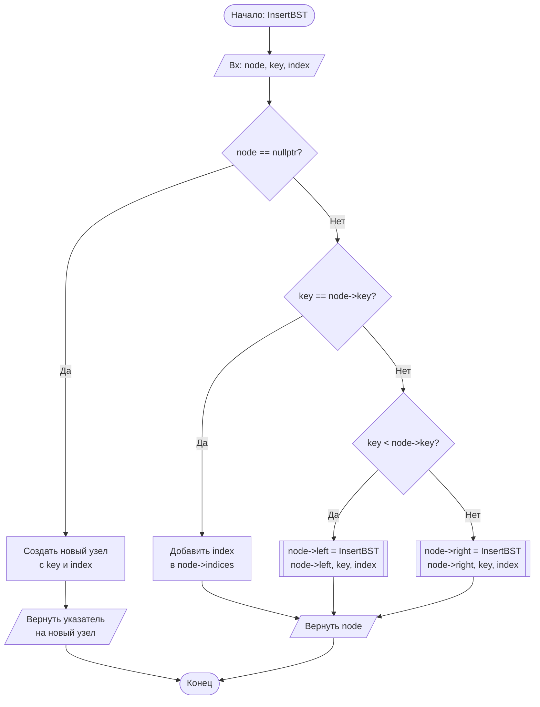
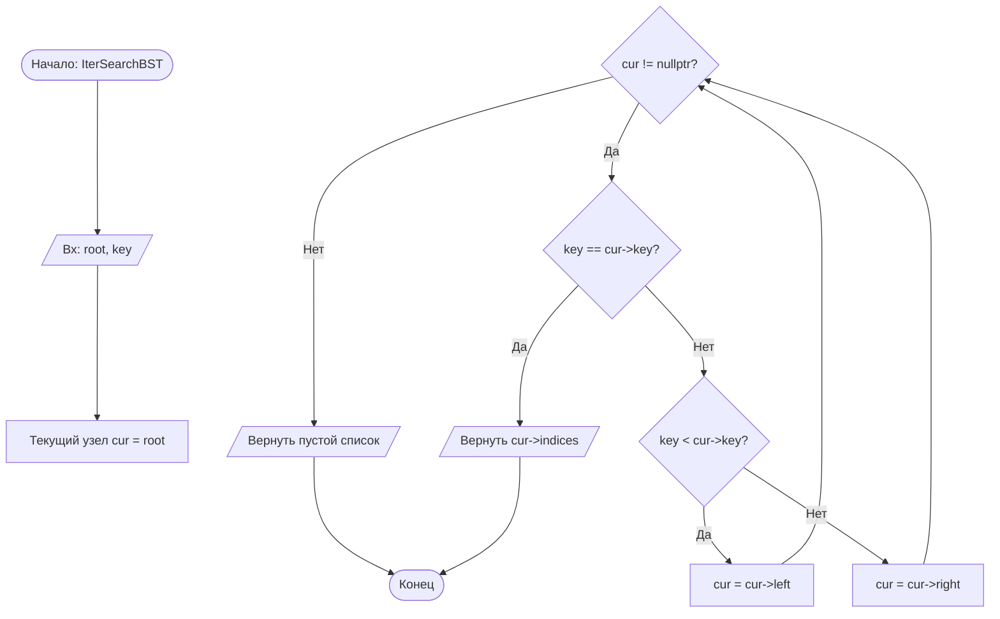
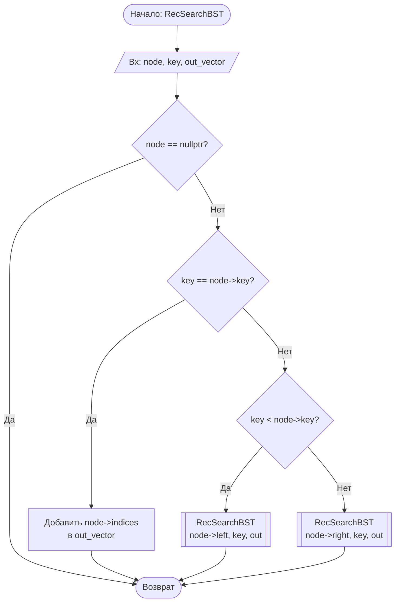
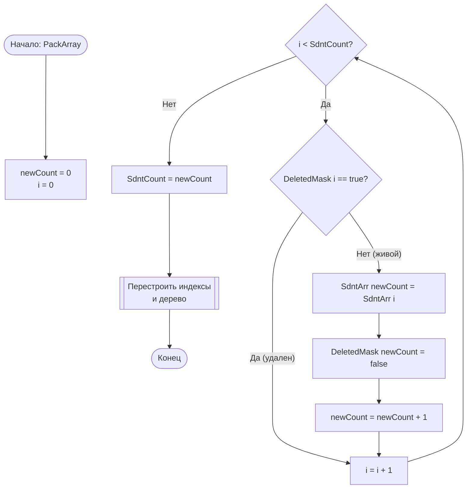

# Блок-схемы алгоритмов (ГОСТ 19.701-90)

Ниже представлены блок-схемы ключевых алгоритмов программы, реализованные в синтаксисе Mermaid.

## 1. Вставка узла в BST (InsertBST)
Алгоритм рекурсивно ищет место для вставки. Особенность: при совпадении ключа (фамилии) новый индекс добавляется в список индексов существующего узла (обработка однофамильцев).

## 2. Итерационный поиск в BST (IterSearchBST)
Поиск выполняется в цикле без использования стека вызовов, что экономит память.

## 3. Рекурсивный поиск в BST (RecSearchBST)
Классический алгоритм спуска по дереву.

## 4. Физическое удаление записей (PackArray)
Алгоритм "уплотнения" массива. Переносит все не удаленные (DeletedMask == false) записи в начало массива, перезаписывая удаленные.

