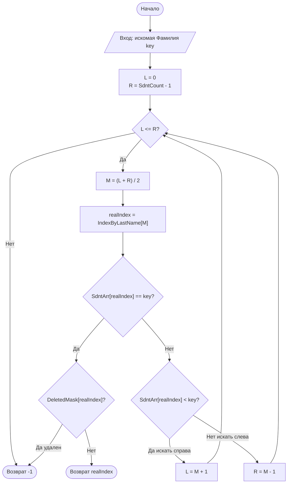
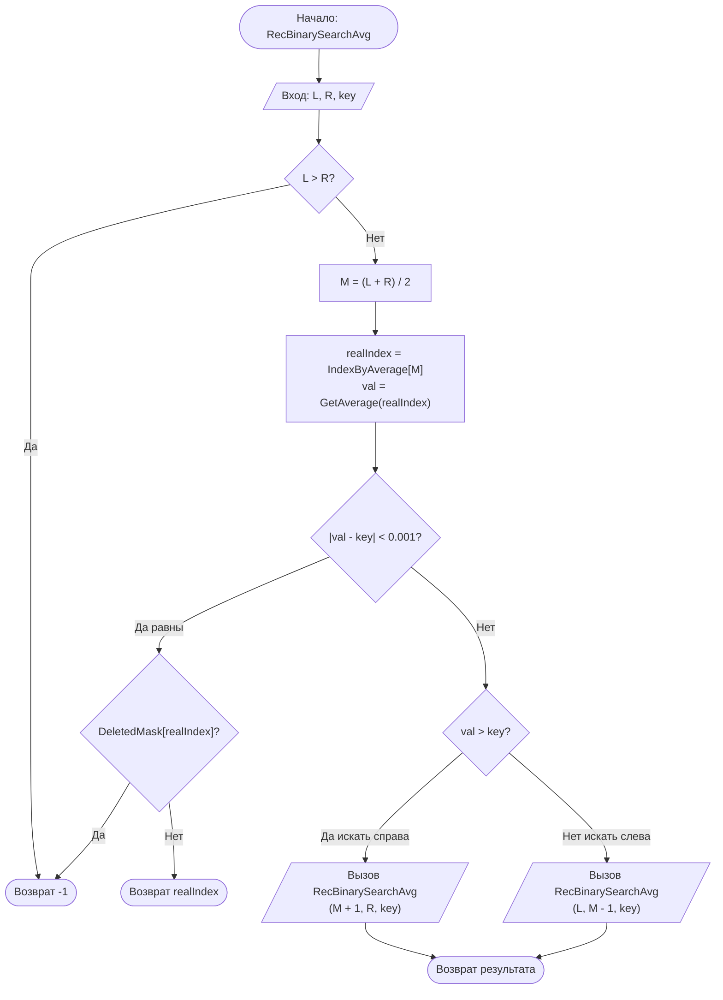

# Student Database Management System (C++)

Программа для управления базой данных студентов, разработанная в рамках самостоятельной работы по курсу «Алгоритмы и структуры данных». Реализует основные операции: добавление, хранение, сортировку, поиск и модификацию записей о студентах.

## 📋 Функциональность

*   **Управление записями:** Ввод данных (ФИО, год рождения, оценки), редактирование и удаление.
*   **Файловые операции:** Сохранение и загрузка базы данных в формате `.csv`.
*   **Индексация:** Построение индексов по фамилии и среднему баллу.
*   **Сортировка:** Использование алгоритмов сортировки (вставками и пузырьком) для упорядочивания индексов.
*   **Поиск:**
    *   Итерационный бинарный поиск по фамилии.
    *   Рекурсивный бинарный поиск по среднему баллу.

## 📄 Документация

Полное описание структуры данных, тестов и теоретической части доступно в отчете:
👉 **[Открыть отчет (report.md)](report.md)**

## 🛠 Как запустить

1.  Склонируйте репозиторий или скачайте `main.cpp`.
2.  Скомпилируйте файл с помощью g++:
    ```bash
    g++ main.cpp -o student_db
    ```
3.  Запустите программу:
    ```bash
    ./student_db
    ```
    *(Для корректного отображения кириллицы в Windows может потребоваться настройка кодировки консоли `chcp 1251` или аналогичная)*.

---

## 🧩 Блок-схемы алгоритмов поиска

Ниже представлены алгоритмы, используемые для поиска записей в индексированных массивах.

### 1. Итерационный бинарный поиск (по Фамилии)
Поиск выполняется в цикле `while` по отсортированному (A-Z) индексу фамилий.



### 2. Рекурсивный бинарный поиск (по Среднему баллу)
Поиск выполняется рекурсивно. Индекс отсортирован по убыванию (High to Low). Сравнение вещественных чисел происходит с точностью `0.001`.


