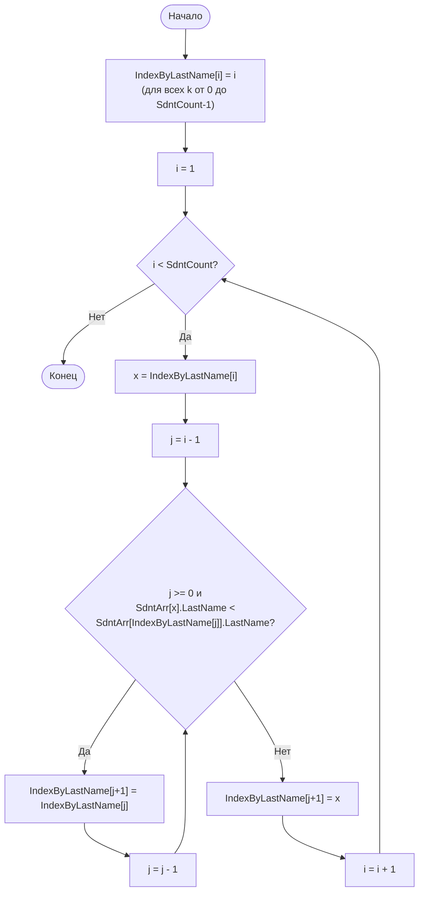
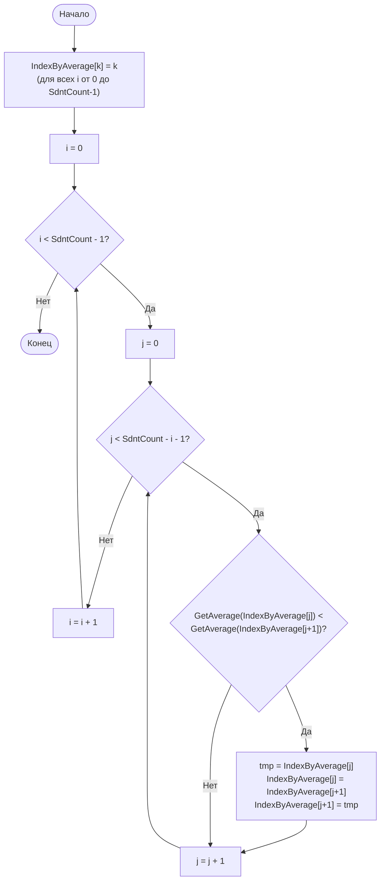
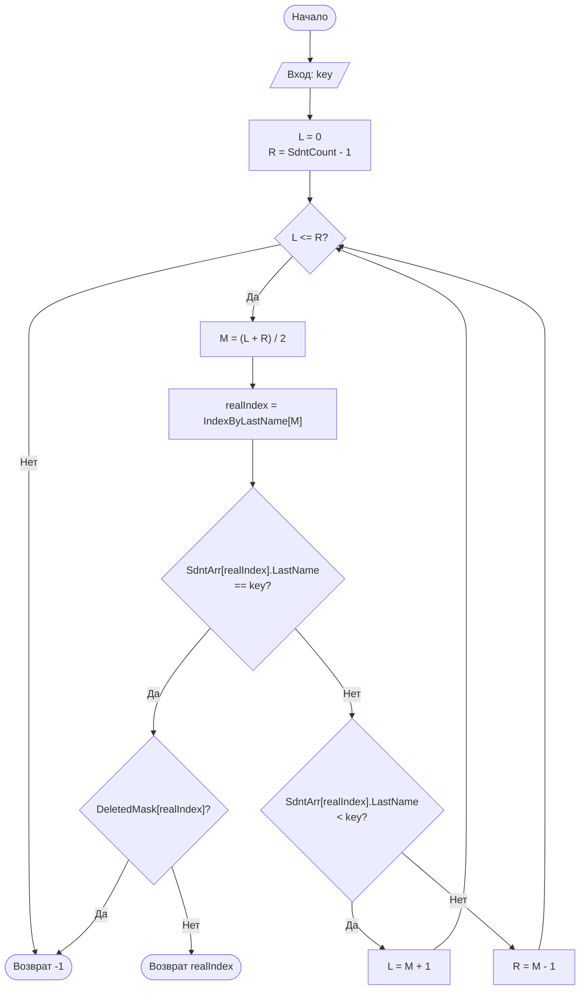
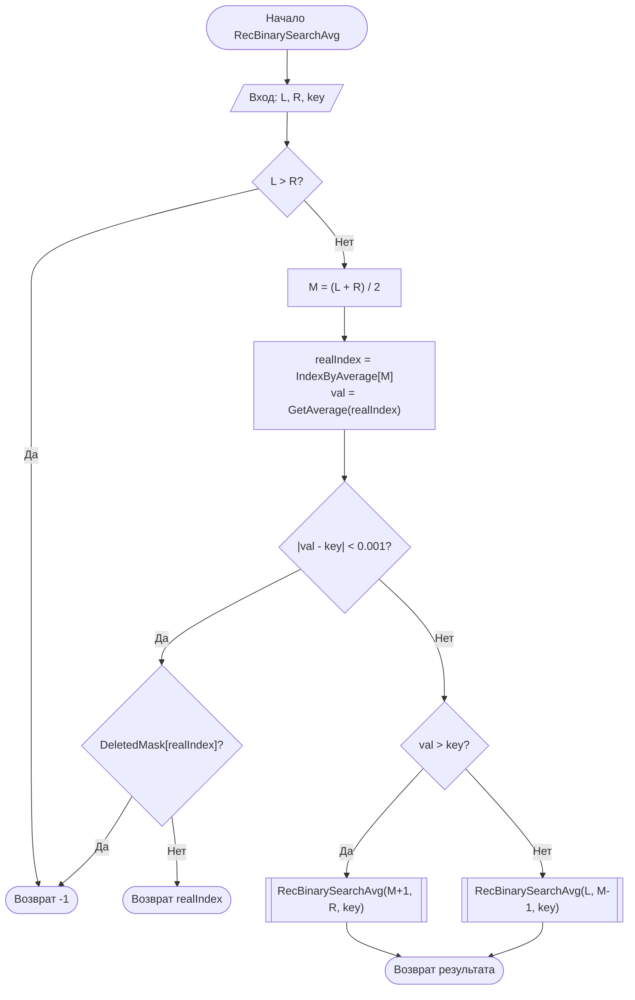

# Блок-схемы алгоритмов по ГОСТ 19.701-90

Данные блок-схемы соответствуют коду программы управления базой данных студентов (main.cpp) и требованиям ГОСТ 19.701-90 «Единая система программной документации. Схемы алгоритмов, программ, данных и систем. Обозначения условные и правила выполнения».

## 1. Сортировка по фамилии (Insertion Sort)

Функция `BuildIndexByLastName()` реализует сортировку вставками индексного массива по фамилиям студентов в алфавитном порядке.

```mermaid
flowchart TD
    Start([Начало]) --> InitArr["IndexByLastName[i] = i<br/>(для всех k от 0 до SdntCount-1)"]
    InitArr --> InitI["i = 1"]
    InitI --> CondI{"i < SdntCount?"}

    CondI -- Нет --> End([Конец])
    CondI -- Да --> SetX["x = IndexByLastName[i]"]
    SetX --> SetJ["j = i - 1"]

    SetJ --> CondWhile{"j >= 0 и<br/>SdntArr[x].LastName <<br/>SdntArr[IndexByLastName[j]].LastName?"}

    CondWhile -- Да --> MoveElem["IndexByLastName[j+1] = IndexByLastName[j]"]
    MoveElem --> DecJ["j = j - 1"]
    DecJ --> CondWhile

    CondWhile -- Нет --> InsertX["IndexByLastName[j+1] = x"]
    InsertX --> IncI["i = i + 1"]
    IncI --> CondI
```

**Описание алгоритма:**
- Инициализация индексного массива значениями от 0 до SdntCount-1
- Для каждого элемента начиная с позиции 1:
  - Сохранение текущего индекса в переменную x
  - Сдвиг элементов вправо, пока находим правильную позицию для вставки
  - Вставка элемента на найденную позицию

**Сложность:** O(n²) в худшем случае, O(n) в лучшем случае

---

## 2. Сортировка по среднему баллу (Bubble Sort)

Функция `BuildIndexByAverage()` реализует пузырьковую сортировку индексного массива по среднему баллу студентов в порядке убывания.

```mermaid
flowchart TD
    Start([Начало]) --> InitArr["IndexByAverage[k] = k<br/>(для всех i от 0 до SdntCount-1)"]
    InitArr --> InitI["i = 0"]
    InitI --> CondI{"i < SdntCount - 1?"}

    CondI -- Нет --> End([Конец])
    CondI -- Да --> InitJ["j = 0"]

    InitJ --> CondJ{"j < SdntCount - i - 1?"}
    CondJ -- Нет --> IncI["i = i + 1"]
    IncI --> CondI

    CondJ -- Да --> CheckSwap{"GetAverage(IndexByAverage[j]) <<br/>GetAverage(IndexByAverage[j+1])?"}

    CheckSwap -- Да --> Swap["tmp = IndexByAverage[j]<br/>IndexByAverage[j] = IndexByAverage[j+1]<br/>IndexByAverage[j+1] = tmp"]
    Swap --> IncJ["j = j + 1"]

    CheckSwap -- Нет --> IncJ
    IncJ --> CondJ
```

**Описание алгоритма:**
- Инициализация индексного массива значениями от 0 до SdntCount-1
- Внешний цикл проходит n-1 раз
- Внутренний цикл сравнивает соседние элементы
- Если средний балл левого элемента меньше правого, происходит обмен индексов
- С каждой итерацией внешнего цикла максимальный элемент "всплывает" в конец

**Сложность:** O(n²) во всех случаях

---

## 3. Итеративный бинарный поиск по фамилии

Функция `IterBinarySearchLastName(string key)` выполняет бинарный поиск студента по фамилии в отсортированном индексном массиве `IndexByLastName`.

```mermaid
flowchart TD
    Start([Начало]) --> Input[/Вход: key/]
    Input --> InitBounds["L = 0<br/>R = SdntCount - 1"]

    InitBounds --> CondLoop{"L <= R?"}
    CondLoop -- Нет --> RetNotFound([Возврат -1])

    CondLoop -- Да --> CalcM["M = (L + R) / 2"]
    CalcM --> GetIdx["realIndex = IndexByLastName[M]"]

    GetIdx --> CheckEq{"SdntArr[realIndex].LastName<br/>== key?"}

    CheckEq -- Да --> CheckDel{"DeletedMask[realIndex]?"}
    CheckDel -- Да --> RetNotFound
    CheckDel -- Нет --> RetFound([Возврат realIndex])

    CheckEq -- Нет --> CheckLess{"SdntArr[realIndex].LastName<br/>< key?"}
    CheckLess -- Да --> SetL["L = M + 1"]
    CheckLess -- Нет --> SetR["R = M - 1"]

    SetL --> CondLoop
    SetR --> CondLoop
```

**Описание алгоритма:**
- Инициализация границ поиска (L=0, R=SdntCount-1)
- Пока L ≤ R:
  - Вычисление средней позиции M
  - Получение реального индекса из индексного массива
  - Сравнение фамилии с ключом
  - Если совпадение найдено, проверка маски удаления
  - Если не совпадает, сужение границ поиска

**Сложность:** O(log n)

**Возвращаемое значение:**
- Индекс найденного студента (≥0)
- -1, если студент не найден или помечен как удаленный

---

## 4. Рекурсивный бинарный поиск по среднему баллу

Функция `RecBinarySearchAvg(int L, int R, double key)` выполняет рекурсивный бинарный поиск студента по среднему баллу в отсортированном индексном массиве `IndexByAverage`.

```mermaid
flowchart TD
    Start([Начало RecBinarySearchAvg]) --> Input[/Вход: L, R, key/]

    Input --> CheckBase{"L > R?"}
    CheckBase -- Да --> RetNotFound([Возврат -1])

    CheckBase -- Нет --> CalcM["M = (L + R) / 2"]
    CalcM --> GetVal["realIndex = IndexByAverage[M]<br/>val = GetAverage(realIndex)"]

    GetVal --> CheckEq{"|val - key| < 0.001?"}

    CheckEq -- Да --> CheckDel{"DeletedMask[realIndex]?"}
    CheckDel -- Да --> RetNotFound
    CheckDel -- Нет --> RetFound([Возврат realIndex])

    CheckEq -- Нет --> CheckGreater{"val > key?"}

    CheckGreater -- Да --> CallRight[["RecBinarySearchAvg(M+1, R, key)"]]
    CheckGreater -- Нет --> CallLeft[["RecBinarySearchAvg(L, M-1, key)"]]

    CallRight --> End([Возврат результата])
    CallLeft --> End
```

**Описание алгоритма:**
- Базовый случай: если L > R, возврат -1 (не найдено)
- Вычисление средней позиции M
- Получение реального индекса и среднего балла
- Сравнение среднего балла с ключом (с точностью 0.001)
- Если совпадение найдено, проверка маски удаления
- Рекурсивный вызов для соответствующей половины массива:
  - Если val > key: поиск в правой половине [M+1, R]
  - Если val < key: поиск в левой половине [L, M-1]

**Сложность:** O(log n)

**Возвращаемое значение:**
- Индекс найденного студента (≥0)
- -1, если студент не найден или помечен как удаленный

**Особенности:**
- Используется сравнение с плавающей точкой через `fabs(val - key) < 0.001`
- Массив отсортирован по убыванию среднего балла

---

## Примечания

### Используемые структуры данных

- **SdntArr[]** - основной массив структур Student
- **IndexByLastName[]** - индексный массив для сортировки по фамилии
- **IndexByAverage[]** - индексный массив для сортировки по среднему баллу
- **DeletedMask[]** - массив логических флагов удаленных записей
- **SdntCount** - количество студентов в массиве

### Соответствие ГОСТу

Все блок-схемы выполнены в соответствии с ГОСТ 19.701-90:
- Используются стандартные обозначения символов
- Основной поток направлен сверху вниз
- Условия содержат явные метки "Да" и "Нет"
- Текст внутри блоков лаконичен и понятен

### Автор

Блок-схемы составлены для программы управления базой данных студентов (main.cpp)

---

**Дата:** 30 ноября 2025 г.
