# Student Database Management System (C++)

Программа для управления базой данных студентов, разработанная в рамках самостоятельной работы по курсу «Алгоритмы и структуры данных». Реализует основные операции: добавление, хранение, сортировку, поиск и модификацию записей о студентах.

## 📋 Функциональность

*   **Управление записями:** Ввод данных (ФИО, год рождения, оценки), редактирование и удаление.
*   **Файловые операции:** Сохранение и загрузка базы данных в формате `.csv`.
*   **Индексация:** Построение индексов по фамилии и среднему баллу.
*   **Сортировка:** Использование алгоритмов сортировки (вставками и пузырьком) для упорядочивания индексов.
*   **Поиск:**
    *   Итерационный бинарный поиск по фамилии.
    *   Рекурсивный бинарный поиск по среднему баллу.

## 📄 Документация

Полное описание структуры данных, тестов и теоретической части доступно в отчете:
👉 **[Открыть отчет (report.md)](report.md)**

## 🛠 Как запустить

1.  Склонируйте репозиторий или скачайте `main.cpp`.
2.  Скомпилируйте файл с помощью g++:
    ```bash
    g++ main.cpp -o student_db
    ```
3.  Запустите программу:
    ```bash
    ./student_db
    ```
    *(Для корректного отображения кириллицы в Windows может потребоваться настройка кодировки консоли `chcp 1251` или аналогичная)*.

---

## 🧩 Блок-схемы алгоритмов

### 1. Сортировка по фамилии (Insertion Sort)

```mermaid
flowchart TD
    Start([Начало]) --> InitArr["IndexByLastName[k] = k<br/>(для всех k от 0 до SdntCount-1)"]
    InitArr --> InitI["i = 1"]
    InitI --> CondI{"i < SdntCount?"}

    CondI -- Нет --> End([Конец])
    CondI -- Да --> SetX["x = IndexByLastName[i]"]
    SetX --> SetJ["j = i - 1"]

    SetJ --> CondWhile{"j >= 0 и<br/>SdntArr[x].LastName < SdntArr[Index[j]].LastName?"}

    CondWhile -- Да --> MoveElem["IndexByLastName[j+1] = IndexByLastName[j]"]
    MoveElem --> DecJ["j = j - 1"]
    DecJ --> CondWhile

    CondWhile -- Нет --> InsertX["IndexByLastName[j+1] = x"]
    InsertX --> IncI["i = i + 1"]
    IncI --> CondI
```



### 2. Сортировка по среднему баллу (Bubble Sort)

```mermaid
flowchart TD
    Start([Начало]) --> InitArr["IndexByAverage[k] = k<br/>(для всех k от 0 до SdntCount-1)"]
    InitArr --> InitI["i = 0"]
    InitI --> CondI{"i < SdntCount - 1?"}

    CondI -- Нет --> End([Конец])
    CondI -- Да --> InitJ["j = 0"]

    InitJ --> CondJ{"j < SdntCount - i - 1?"}
    CondJ -- Нет --> IncI["i = i + 1"]
    IncI --> CondI

    CondJ -- Да --> CheckSwap{"Avg(Index[j]) < Avg(Index[j+1])?"}

    CheckSwap -- Да --> Swap["tmp = Index[j]<br/>Index[j] = Index[j+1]<br/>Index[j+1] = tmp"]
    Swap --> IncJ["j = j + 1"]

    CheckSwap -- Нет --> IncJ
    IncJ --> CondJ

```



### 3. Итеративный бинарный поиск по фамилии

```mermaid
flowchart TD
    Start([Начало]) --> Input[/Вход: key/]
    Input --> InitBounds["L = 0<br/>R = SdntCount - 1"]

    InitBounds --> CondLoop{"L <= R?"}
    CondLoop -- Нет --> RetNotFound([Возврат -1])

    CondLoop -- Да --> CalcM["M = (L + R) / 2"]
    CalcM --> GetIdx["realIndex = IndexByLastName[M]"]

    GetIdx --> CheckEq{"SdntArr[realIndex].LastName == key?"}

    CheckEq -- Да --> CheckDel{"DeletedMask[realIndex]?"}
    CheckDel -- Да --> RetNotFound
    CheckDel -- Нет --> RetFound([Возврат realIndex])

    CheckEq -- Нет --> CheckLess{"SdntArr[realIndex].LastName < key?"}
    CheckLess -- Да --> SetL["L = M + 1"]
    CheckLess -- Нет --> SetR["R = M - 1"]

    SetL --> CondLoop
    SetR --> CondLoop
```



### 4. Рекурсивный бинарный поиск по среднему баллу

```mermaid
flowchart TD
    Start([Начало RecBinarySearchAvg]) --> Input[/Вход: L, R, key/]

    Input --> CheckBase{"L > R?"}
    CheckBase -- Да --> RetNotFound([Возврат -1])

    CheckBase -- Нет --> CalcM["M = (L + R) / 2"]
    CalcM --> GetVal["realIndex = IndexByAverage[M]<br/>val = GetAverage(realIndex)"]

    GetVal --> CheckEq{"|val - key| < 0.001?"}

    CheckEq -- Да --> CheckDel{"DeletedMask[realIndex]?"}
    CheckDel -- Да --> RetNotFound
    CheckDel -- Нет --> RetFound([Возврат realIndex])

    CheckEq -- Нет --> CheckGreater{"val > key?"}

    CheckGreater -- Да --> CallRight[["Вызов RecBinarySearchAvg(M+1, R, key)"]]
    CheckGreater -- Нет --> CallLeft[["Вызов RecBinarySearchAvg(L, M-1, key)"]]

    CallRight --> End([Возврат результата])
    CallLeft --> End
```


